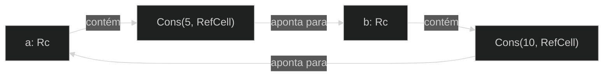

# Ciclos de Referência Podem Vazar Memória

As garantias de segurança de memória do Rust tornam difícil, mas não impossível, criar acidentalmente memória que nunca é limpa (conhecido como *vazamento de memória*). Impedir completamente vazamentos de memória não é uma das garantias do Rust, o que significa que vazamentos de memória são seguros para a memória em Rust. Podemos ver que o Rust permite vazamentos de memória usando `Rc<T>` e `RefCell<T>`: é possível criar referências onde os itens se referem uns aos outros em um ciclo. Isso cria vazamentos de memória porque a contagem de referências de cada item no ciclo nunca chegará a 0, e os valores nunca serão descartados.

### Criando um Ciclo de Referência

Vamos ver como um ciclo de referência pode acontecer e como evitá-lo, começando com a definição do enum `List` e um método `tail` na Listagem 15-25:

Nome do arquivo: src/main.rs

```rust
use crate::List::{Cons, Nil};
use std::cell::RefCell;
use std::rc::Rc;

#[derive(Debug)]
enum List {
    Cons(i32, RefCell<Rc<List>>),
    Nil,
}

impl List {
    fn tail(&self) -> Option<&RefCell<Rc<List>>> {
        match self {
            Cons(_, item) => Some(item),
            Nil => None,
        }
    }
}

fn main() {}
```

Listagem 15-25: Uma definição de lista cons que contém um `RefCell<T>` para que possamos modificar a que uma variante `Cons` está se referindo

Estamos usando outra variação da definição de `List` da Listagem 15-5. O segundo elemento na variante `Cons` agora é `RefCell<Rc<List>>`, o que significa que, em vez de ter a capacidade de modificar o valor `i32` como fizemos na Listagem 15-24, queremos modificar o valor `List` para o qual uma variante `Cons` está apontando. Também estamos adicionando um método `tail` para tornar conveniente para nós acessar o segundo item se tivermos uma variante `Cons`.

Na Listagem 15-26, estamos adicionando uma função `main` que usa as definições na Listagem 15-25. Este código cria uma lista em `a` e uma lista em `b` que aponta para a lista em `a`. Em seguida, ele modifica a lista em `a` para apontar para `b`, criando um ciclo de referência. Existem instruções `println!` ao longo do caminho para mostrar quais são as contagens de referência em vários pontos neste processo.

Nome do arquivo: src/main.rs

```rust
use crate::List::{Cons, Nil};
use std::cell::RefCell;
use std::rc::Rc;

#[derive(Debug)]
enum List {
    Cons(i32, RefCell<Rc<List>>),
    Nil,
}

impl List {
    fn tail(&self) -> Option<&RefCell<Rc<List>>> {
        match self {
            Cons(_, item) => Some(item),
            Nil => None,
        }
    }
}

fn main() {
    let a = Rc::new(Cons(5, RefCell::new(Rc::new(Nil))));

    println!("a initial rc count = {}", Rc::strong_count(&a));
    println!("a next item = {:?}", a.tail());

    let b = Rc::new(Cons(10, RefCell::new(Rc::clone(&a))));

    println!("a rc count after b creation = {}", Rc::strong_count(&a));
    println!("b initial rc count = {}", Rc::strong_count(&b));
    println!("b next item = {:?}", b.tail());

    if let Some(link) = a.tail() {
        *link.borrow_mut() = Rc::clone(&b);
    }

    println!("b rc count after changing a = {}", Rc::strong_count(&b));
    println!("a rc count after changing a = {}", Rc::strong_count(&a));

    // Descomente a próxima linha para ver que temos um ciclo;
    // ele irá estourar a pilha
    // println!("a next item = {:?}", a.tail());
}
```

Listagem 15-26: Criando um ciclo de referência de dois valores `List` apontando um para o outro

Criamos uma instância `Rc<List>` contendo um valor `List` na variável `a` com uma lista inicial de `5, Nil`. Em seguida, criamos uma instância `Rc<List>` contendo outro valor `List` na variável `b` que contém o valor 10 e aponta para a lista em `a`.

Modificamos `a` para que ele aponte para `b` em vez de `Nil`, criando um ciclo. Fazemos isso usando o método `tail` para obter uma referência ao `RefCell<Rc<List>>` em `a`, que colocamos na variável `link`. Em seguida, usamos o método `borrow_mut` no `RefCell<Rc<List>>` para alterar o valor interno de um `Rc<List>` que contém um valor `Nil` para o `Rc<List>` em `b`.

Quando executamos este código, mantendo o último `println!` comentado por enquanto, obteremos esta saída:

```text
$ cargo run
   Compiling cons-list v0.1.0 (file:///projects/cons-list)
    Finished `dev` profile [unoptimized + debuginfo] target(s) in 0.53s
     Running `target/debug/cons-list`
a initial rc count = 1
a next item = Some(RefCell { value: Nil })
a rc count after b creation = 2
b initial rc count = 1
b next item = Some(RefCell { value: Cons(5, RefCell { value: Nil }) })
b rc count after changing a = 2
a rc count after changing a = 2
```

A contagem de referências das instâncias `Rc<List>` em `a` e `b` é 2 depois que alteramos a lista em `a` para apontar para `b`. No final de `main`, o Rust descarta a variável `b`, o que diminui a contagem de referências da instância `b` `Rc<List>` de 2 para 1. A memória que `Rc<List>` tem na heap não será descartada neste ponto, porque sua contagem de referências é 1, não 0. Em seguida, o Rust descarta `a`, o que diminui a contagem de referências da instância `a` `Rc<List>` de 2 para 1 também. A memória desta instância também não pode ser descartada, porque a outra instância `Rc<List>` ainda se refere a ela. A memória alocada para a lista permanecerá não coletada para sempre. Para visualizar este ciclo de referência, criamos um diagrama na Figura 15-4.



Figura 15-4: Um ciclo de referência das listas `a` e `b` apontando uma para a outra

Se você descomentar o último `println!` e executar o programa, o Rust tentará imprimir este ciclo com `a` apontando para `b` apontando para `a` e assim por diante até que ele estoure a pilha.

Comparado a um programa do mundo real, as consequências de criar um ciclo de referência neste exemplo não são muito graves: logo após criarmos o ciclo de referência, o programa termina. No entanto, se um programa mais complexo alocasse muita memória em um ciclo e a mantivesse por um longo tempo, o programa usaria mais memória do que o necessário e poderia sobrecarregar o sistema, fazendo com que ele ficasse sem memória disponível.

Criar ciclos de referência não é fácil, mas também não é impossível. Se você tiver valores `RefCell<T>` que contêm valores `Rc<T>` ou combinações aninhadas semelhantes de tipos com mutabilidade interior e contagem de referências, você deve garantir que não crie ciclos; você não pode confiar no Rust para pegá-los. Criar um ciclo de referência seria um bug lógico em seu programa que você deve usar testes automatizados, revisões de código e outras práticas de desenvolvimento de software para minimizar.

Outra solução para evitar ciclos de referência é reorganizar suas estruturas de dados para que algumas referências expressem propriedade e algumas referências não. Como resultado, você pode ter ciclos compostos por algumas relações de propriedade e algumas relações de não propriedade, e apenas as relações de propriedade afetam se um valor pode ou não ser descartado. Na Listagem 15-25, sempre queremos que as variantes `Cons` possuam sua lista, então reorganizar a estrutura de dados não é possível. Vamos dar uma olhada em um exemplo usando gráficos compostos por nós pais e nós filhos para ver quando as relações de não propriedade são uma maneira apropriada de evitar ciclos de referência.

### Prevenindo Ciclos de Referência: Transformando um `Rc<T>` em um `Weak<T>`

Até agora, demonstramos que chamar `Rc::clone` aumenta a `strong_count` de uma instância `Rc<T>`, e uma instância `Rc<T>` só é limpa se sua `strong_count` for 0. Você também pode criar uma *referência fraca* ao valor dentro de uma instância `Rc<T>` chamando `Rc::downgrade` e passando uma referência ao `Rc<T>`. As referências fortes são como você pode compartilhar a propriedade de uma instância `Rc<T>`. As referências fracas não expressam uma relação de propriedade, e sua contagem não afeta quando uma instância `Rc<T>` é limpa. Elas não causarão um ciclo de referência porque qualquer ciclo envolvendo algumas referências fracas será quebrado quando a contagem de referências fortes dos valores envolvidos for 0.

Quando você chama `Rc::downgrade`, você obtém um ponteiro inteligente do tipo `Weak<T>`. Em vez de aumentar a `strong_count` na instância `Rc<T>` em 1, chamar `Rc::downgrade` aumenta a `weak_count` em 1. O tipo `Rc<T>` usa `weak_count` para rastrear quantas referências `Weak<T>` existem, semelhante a `strong_count`. A diferença é que a `weak_count` não precisa ser 0 para que a instância `Rc<T>` seja limpa.

Como o valor para o qual `Weak<T>` faz referência pode ter sido descartado, para fazer qualquer coisa com o valor para o qual um `Weak<T>` está apontando, você deve se certificar de que o valor ainda existe. Faça isso chamando o método `upgrade` em uma instância `Weak<T>`, que retornará um `Option<Rc<T>>`. Você obterá um resultado `Some` se o valor `Rc<T>` ainda não tiver sido descartado e um resultado `None` se o valor `Rc<T>` tiver sido descartado. Como `upgrade` retorna um `Option<Rc<T>>`, o Rust garantirá que o caso `Some` e o caso `None` sejam tratados, e não haverá um ponteiro inválido.

Como exemplo, em vez de usar uma lista cujos itens sabem apenas sobre o próximo item, criaremos uma árvore cujos itens sabem sobre seus itens filhos *e* seus itens pais.

#### Criando uma Estrutura de Dados de Árvore: um `Node` com Nós Filhos

Para começar, construiremos uma árvore com nós que conhecem seus nós filhos. Criaremos uma struct chamada `Node` que contém seu próprio valor `i32`, bem como referências aos seus valores `Node` filhos:

Nome do arquivo: src/main.rs

```rust
use std::cell::RefCell;
use std::rc::Rc;

#[derive(Debug)]
struct Node {
    value: i32,
    children: RefCell<Vec<Rc<Node>>>,
}

fn main() {
    let leaf = Rc::new(Node {
        value: 3,
        children: RefCell::new(vec![]),
    });

    let branch = Rc::new(Node {
        value: 5,
        children: RefCell::new(vec![Rc::clone(&leaf)]),
    });
}
```

Queremos que um `Node` possua seus filhos e queremos compartilhar essa propriedade com variáveis para que possamos acessar cada `Node` na árvore diretamente. Para fazer isso, definimos os itens `Vec<T>` como valores do tipo `Rc<Node>`. Também queremos modificar quais nós são filhos de outro nó, então temos um `RefCell<T>` em `children` em torno do `Vec<Rc<Node>>`.

Em seguida, usaremos nossa definição de struct e criaremos uma instância `Node` chamada `leaf` com o valor 3 e sem filhos, e outra instância chamada `branch` com o valor 5 e `leaf` como um de seus filhos, conforme mostrado na Listagem 15-27:

Nome do arquivo: src/main.rs

```rust
use std::cell::RefCell;
use std::rc::Rc;

#[derive(Debug)]
struct Node {
    value: i32,
    children: RefCell<Vec<Rc<Node>>>,
}

fn main() {
    let leaf = Rc::new(Node {
        value: 3,
        children: RefCell::new(vec![]),
    });

    let branch = Rc::new(Node {
        value: 5,
        children: RefCell::new(vec![Rc::clone(&leaf)]),
    });
}
```

Listagem 15-27: Criando um nó `leaf` sem filhos e um nó `branch` com `leaf` como um de seus filhos

Clonamos o `Rc<Node>` em `leaf` e o armazenamos em `branch`, o que significa que o `Node` em `leaf` agora tem dois proprietários: `leaf` e `branch`. Podemos ir de `branch` para `leaf` através de `branch.children`, mas não há como ir de `leaf` para `branch`. O motivo é que `leaf` não tem referência a `branch` e não sabe que eles estão relacionados. Queremos que `leaf` saiba que `branch` é seu pai. Faremos isso a seguir.

#### Adicionando uma Referência de um Filho para Seu Pai

Para tornar o nó filho ciente de seu pai, precisamos adicionar um campo `parent` à nossa definição de struct `Node`. O problema é decidir qual deve ser o tipo de `parent`. Sabemos que ele não pode conter um `Rc<T>`, porque isso criaria um ciclo de referência com `leaf.parent` apontando para `branch` e `branch.children` apontando para `leaf`, o que faria com que seus valores `strong_count` nunca fossem 0.

Pensando nas relações de outra forma, um nó pai deve possuir seus filhos: se um nó pai for descartado, seus nós filhos também devem ser descartados. No entanto, um filho não deve possuir seu pai: se descartarmos um nó filho, o pai ainda deve existir. Este é um caso para referências fracas!

Então, em vez de `Rc<T>`, faremos o tipo de `parent` usar `Weak<T>`, especificamente um `RefCell<Weak<Node>>`. Agora nossa definição de struct `Node` se parece com isso:

Nome do arquivo: src/main.rs

```rust
use std::cell::RefCell;
use std::rc::{Rc, Weak};

#[derive(Debug)]
struct Node {
    value: i32,
    parent: RefCell<Weak<Node>>,
    children: RefCell<Vec<Rc<Node>>>,
}

fn main() {
    let leaf = Rc::new(Node {
        value: 3,
        parent: RefCell::new(Weak::new()),
        children: RefCell::new(vec![]),
    });

    println!("leaf parent = {:?}", leaf.parent.borrow().upgrade());

    let branch = Rc::new(Node {
        value: 5,
        parent: RefCell::new(Weak::new()),
        children: RefCell::new(vec![Rc::clone(&leaf)]),
    });

    *leaf.parent.borrow_mut() = Rc::downgrade(&branch);

    println!("leaf parent = {:?}", leaf.parent.borrow().upgrade());
}
```

Um nó será capaz de se referir ao seu nó pai, mas não o possui. Na Listagem 15-28, atualizamos `main` para usar esta nova definição para que o nó `leaf` tenha uma maneira de se referir ao seu pai, `branch`:

Nome do arquivo: src/main.rs

```rust
use std::cell::RefCell;
use std::rc::{Rc, Weak};

#[derive(Debug)]
struct Node {
    value: i32,
    parent: RefCell<Weak<Node>>,
    children: RefCell<Vec<Rc<Node>>>,
}

fn main() {
    let leaf = Rc::new(Node {
        value: 3,
        parent: RefCell::new(Weak::new()),
        children: RefCell::new(vec![]),
    });

    println!("leaf parent = {:?}", leaf.parent.borrow().upgrade());

    let branch = Rc::new(Node {
        value: 5,
        parent: RefCell::new(Weak::new()),
        children: RefCell::new(vec![Rc::clone(&leaf)]),
    });

    *leaf.parent.borrow_mut() = Rc::downgrade(&branch);

    println!("leaf parent = {:?}", leaf.parent.borrow().upgrade());
}
```

Listagem 15-28: Um nó `leaf` com uma referência fraca para seu nó pai `branch`

Criar o nó `leaf` parece semelhante à Listagem 15-27, com exceção do campo `parent`: `leaf` começa sem um pai, então criamos uma nova instância de referência `Weak<Node>` vazia.

Neste ponto, quando tentamos obter uma referência ao pai de `leaf` usando o método `upgrade`, obtemos um valor `None`. Vemos isso na saída da primeira instrução `println!`:

```text
leaf parent = None
```

Quando criamos o nó `branch`, ele também terá uma nova referência `Weak<Node>` no campo `parent`, porque `branch` não tem um nó pai. Ainda temos `leaf` como um dos filhos de `branch`. Depois de termos a instância `Node` em `branch`, podemos modificar `leaf` para dar a ele uma referência `Weak<Node>` ao seu pai. Usamos o método `borrow_mut` no `RefCell<Weak<Node>>` no campo `parent` de `leaf` e, em seguida, usamos a função `Rc::downgrade` para criar uma referência `Weak<Node>` para `branch` a partir do `Rc<Node>` em `branch`.

Quando imprimimos o pai de `leaf` novamente, desta vez obteremos uma variante `Some` contendo `branch`: agora `leaf` pode acessar seu pai! Quando imprimimos `leaf`, também evitamos o ciclo que acabou em um estouro de pilha como tivemos na Listagem 15-26; as referências `Weak<Node>` são impressas como `(Weak)`:

```text
leaf parent = Some(Node { value: 5, parent: RefCell { value: (Weak) },
children: RefCell { value: [Node { value: 3, parent: RefCell { value: (Weak) },
children: RefCell { value: [] } }] } })
```

A falta de saída infinita indica que este código não criou um ciclo de referência. Também podemos dizer isso observando os valores que obtemos ao chamar `Rc::strong_count` e `Rc::weak_count`.

#### Visualizando Alterações em `strong_count` e `weak_count`

Vamos dar uma olhada em como os valores `strong_count` e `weak_count` das instâncias `Rc<Node>` mudam criando um novo escopo interno e movendo a criação de `branch` para esse escopo. Ao fazer isso, podemos ver o que acontece quando `branch` é criado e, em seguida, descartado quando sai do escopo. As modificações são mostradas na Listagem 15-29:

Nome do arquivo: src/main.rs

```rust
use std::cell::RefCell;
use std::rc::{Rc, Weak};

#[derive(Debug)]
struct Node {
    value: i32,
    parent: RefCell<Weak<Node>>,
    children: RefCell<Vec<Rc<Node>>>,
}

fn main() {
    let leaf = Rc::new(Node {
        value: 3,
        parent: RefCell::new(Weak::new()),
        children: RefCell::new(vec![]),
    });

    println!(
        "leaf strong = {}, weak = {}",
        Rc::strong_count(&leaf),
        Rc::weak_count(&leaf),
    );

    {
        let branch = Rc::new(Node {
            value: 5,
            parent: RefCell::new(Weak::new()),
            children: RefCell::new(vec![Rc::clone(&leaf)]),
        });

        *leaf.parent.borrow_mut() = Rc::downgrade(&branch);

        println!(
            "branch strong = {}, weak = {}",
            Rc::strong_count(&branch),
            Rc::weak_count(&branch),
        );

        println!(
            "leaf strong = {}, weak = {}",
            Rc::strong_count(&leaf),
            Rc::weak_count(&leaf),
        );
    }

    println!("leaf parent = {:?}", leaf.parent.borrow().upgrade());
    println!(
        "leaf strong = {}, weak = {}",
        Rc::strong_count(&leaf),
        Rc::weak_count(&leaf),
    );
}
```

Listagem 15-29: Criando `branch` em um escopo interno e examinando as contagens de referências fortes e fracas

Depois que `leaf` é criado, seu `Rc<Node>` tem uma contagem forte de 1 e uma contagem fraca de 0. No escopo interno, criamos `branch` e o associamos a `leaf`, momento em que, quando imprimimos as contagens, o `Rc<Node>` em `branch` terá uma contagem forte de 1 e uma contagem fraca de 1 (para `leaf.parent` apontando para `branch` com um `Weak<Node>`). Quando imprimimos as contagens em `leaf`, veremos que ele terá uma contagem forte de 2, porque `branch` agora tem um clone do `Rc<Node>` de `leaf` armazenado em `branch.children`, mas ainda terá uma contagem fraca de 0.

Quando o escopo interno termina, `branch` sai do escopo e a contagem forte do `Rc<Node>` diminui para 0, então seu `Node` é descartado. A contagem fraca de 1 de `leaf.parent` não tem relação com o fato de `Node` ser descartado ou não, então não obtemos nenhum vazamento de memória!

Se tentarmos acessar o pai de `leaf` após o final do escopo, obteremos `None` novamente. No final do programa, o `Rc<Node>` em `leaf` tem uma contagem forte de 1 e uma contagem fraca de 0, porque a variável `leaf` agora é a única referência ao `Rc<Node>` novamente.

Toda a lógica que gerencia as contagens e o descarte de valores é construída em `Rc<T>` e `Weak<T>` e suas implementações da trait `Drop`. Ao especificar que a relação de um filho para seu pai deve ser uma referência `Weak<T>` na definição de `Node`, você pode ter nós pais apontando para nós filhos e vice-versa sem criar um ciclo de referência e vazamentos de memória.

## Resumo

Este capítulo abordou como usar ponteiros inteligentes para fazer garantias e compensações diferentes daquelas que o Rust faz por padrão com referências regulares. O tipo `Box<T>` tem um tamanho conhecido e aponta para dados alocados na heap. O tipo `Rc<T>` rastreia o número de referências a dados na heap para que os dados possam ter vários proprietários. O tipo `RefCell<T>` com sua mutabilidade interior nos dá um tipo que podemos usar quando precisamos de um tipo imutável, mas precisamos alterar um valor interno desse tipo; ele também impõe as regras de empréstimo em tempo de execução em vez de em tempo de compilação.

Também foram discutidas as traits `Deref` e `Drop`, que habilitam grande parte da funcionalidade dos ponteiros inteligentes. Exploramos ciclos de referência que podem causar vazamentos de memória e como evitá-los usando `Weak<T>`.

Se este capítulo despertou seu interesse e você deseja implementar seus próprios ponteiros inteligentes, confira "The Rustonomicon" para obter informações mais úteis.

Em seguida, falaremos sobre concorrência em Rust. Você aprenderá até mesmo sobre alguns novos ponteiros inteligentes.

