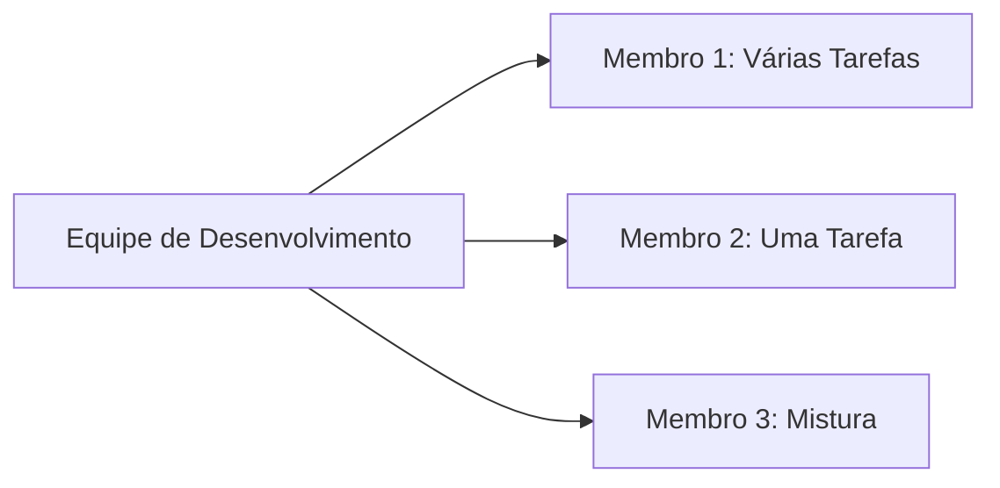

# Fundamentos de Programação Assíncrona: Async, Await, Futures e Streams

Muitas operações que pedimos ao computador para executar podem levar algum tempo para terminar. Seria ótimo se pudéssemos fazer outras coisas enquanto esperamos esses processos de longa duração serem concluídos. Os computadores modernos oferecem duas técnicas para trabalhar em mais de uma operação ao mesmo tempo: paralelismo e concorrência. No entanto, quando começamos a escrever programas que envolvem operações paralelas ou concorrentes, rapidamente encontramos novos desafios inerentes à _programação assíncrona_, onde as operações podem não terminar sequencialmente na ordem em que foram iniciadas. Este capítulo se baseia no uso de threads do Capítulo 16 para paralelismo e concorrência, introduzindo uma abordagem alternativa à programação assíncrona: as Futures, Streams, a sintaxe `async` e `await` que as suporta, e as ferramentas para gerenciar e coordenar entre operações assíncronas.

## Entendendo o Problema

Vamos considerar um exemplo. Digamos que você esteja exportando um vídeo que criou de uma celebração familiar, uma operação que pode levar de minutos a horas. A exportação do vídeo usará toda a potência de CPU e GPU disponível. Se você tivesse apenas um núcleo de CPU e seu sistema operacional não pausasse essa exportação até que ela fosse concluída — ou seja, se executasse a exportação _sincronamente_ — você não poderia fazer mais nada no seu computador enquanto essa tarefa estivesse em execução. Seria uma experiência bastante frustrante. Felizmente, o sistema operacional do seu computador pode, e realmente interrompe a exportação com frequência suficiente para permitir que você faça outros trabalhos simultaneamente.

Agora, digamos que você esteja baixando um vídeo compartilhado por outra pessoa, o que também pode levar algum tempo, mas não ocupa tanto tempo de CPU. Neste caso, a CPU precisa esperar que os dados cheguem da rede. Embora você possa começar a ler os dados assim que eles começarem a chegar, pode levar algum tempo para que todos eles apareçam. Mesmo depois que todos os dados estiverem presentes, se o vídeo for muito grande, pode levar pelo menos um ou dois segundos para carregá-lo completamente. Isso pode não parecer muito, mas é um tempo muito longo para um processador moderno, que pode realizar bilhões de operações a cada segundo. Novamente, seu sistema operacional interromperá invisivamente seu programa para permitir que a CPU realize outro trabalho enquanto espera a chamada de rede terminar.

A exportação de vídeo é um exemplo de uma operação _CPU-bound_ ou _compute-bound_. Ela é limitada pela velocidade potencial de processamento de dados do computador dentro da CPU ou GPU, e por quanto dessa velocidade ele pode dedicar à operação. O download do vídeo é um exemplo de uma operação _IO-bound_, porque é limitada pela velocidade de _entrada e saída_ do computador; ela só pode ser tão rápida quanto os dados podem ser enviados pela rede.

Em ambos os exemplos, as interrupções invisíveis do sistema operacional fornecem uma forma de concorrência. No entanto, essa concorrência acontece apenas no nível do programa inteiro: o sistema operacional interrompe um programa para permitir que outros programas façam trabalho. Em muitos casos, porque entendemos nossos programas em um nível muito mais granular do que o sistema operacional, podemos identificar oportunidades de concorrência que o sistema operacional não consegue ver.

Por exemplo, se estamos construindo uma ferramenta para gerenciar downloads de arquivos, devemos ser capazes de escrever nosso programa de forma que iniciar um download não bloqueie a interface do usuário, e os usuários devem poder iniciar vários downloads ao mesmo tempo. No entanto, muitas APIs de sistema operacional para interagir com a rede são _bloqueantes_; ou seja, elas bloqueiam o progresso do programa até que os dados que estão processando estejam completamente prontos.

> **Nota**: É assim que _a maioria_ das chamadas de função funcionam, se você pensar bem. No entanto, o termo _bloqueante_ é geralmente reservado para chamadas de função que interagem com arquivos, rede ou outros recursos no computador, porque esses são os casos em que um programa individual se beneficiaria da operação ser _não_-bloqueante.

Poderíamos evitar bloquear nossa thread principal iniciando uma thread dedicada para baixar cada arquivo. No entanto, a sobrecarga dessas threads eventualmente se tornaria um problema. Seria preferível se a chamada não bloqueasse desde o início. Também seria melhor se pudéssemos escrever no mesmo estilo direto que usamos em código bloqueante, semelhante a isto:

```rust
let data = fetch_data_from(url).await;
println!("{data}");
```

É exatamente isso que a abstração _async_ (abreviação de _assíncrona_) do Rust nos oferece. Neste capítulo, você aprenderá tudo sobre async enquanto abordamos os seguintes tópicos:
- Como usar a sintaxe `async` e `await` do Rust
- Como usar o modelo async para resolver alguns dos mesmos desafios que vimos no Capítulo 16
- Como multithreading e async fornecem soluções complementares, que você pode combinar em muitos casos

Antes de vermos como async funciona na prática, precisamos fazer um pequeno desvio para discutir as diferenças entre paralelismo e concorrência.

## Paralelismo e Concorrência

Até agora, tratamos paralelismo e concorrência como praticamente intercambiáveis. Agora precisamos distingui-los com mais precisão, porque as diferenças aparecerão à medida que começarmos a trabalhar.

Considere as diferentes maneiras como uma equipe poderia dividir o trabalho em um projeto de software. Você poderia atribuir a um único membro várias tarefas, atribuir a cada membro uma tarefa, ou usar uma mistura das duas abordagens.



### Concorrência: Alternando Entre Tarefas

Quando um indivíduo trabalha em várias tarefas diferentes antes que qualquer uma delas esteja completa, isso é _concorrência_. Talvez você tenha dois projetos diferentes no seu computador, e quando fica entediado ou travado em um projeto, muda para o outro. Você é apenas uma pessoa, então não pode progredir em ambas as tarefas ao mesmo tempo, mas pode realizar múltiplas tarefas, progredindo em uma de cada vez, alternando entre elas.

```mermaid
gantt
    title Figura 17-1: Fluxo de trabalho concorrente
    dateFormat s
    axisFormat %S
    
    section Desenvolvimento
    Tarefa A1 :a1, 0, 2s
    Tarefa B1 :b1, after a1, 3s
    Tarefa A2 :a2, after b1, 2s
    Tarefa B2 :b2, after a2, 3s
    Tarefa A3 :a3, after b2, 2s
```



### Paralelismo: Progresso Simultâneo

Quando a equipe divide um grupo de tarefas, tendo cada membro assumir uma tarefa e trabalhar nela sozinho, isso é _paralelismo_. Cada pessoa na equipe pode progredir exatamente ao mesmo tempo.

```mermaid
gantt
    title Figura 17-2: Fluxo de trabalho paralelo
    dateFormat s
    axisFormat %S
    
    section Desenvolvedor 1
    Tarefa A1 :a1, 0, 2s
    Tarefa A2 :a2, after a1, 2s
    Tarefa A3 :a3, after a2, 2s
    
    section Desenvolvedor 2
    Tarefa B1 :b1, 0, 3s
    Tarefa B2 :b2, after b1, 3s
    Tarefa B3 :b3, after b2, 3s
```



### Tarefas Interdependentes

Em ambos os fluxos de trabalho, pode ser necessário coordenar entre diferentes tarefas. Talvez você _pensasse_ que a tarefa atribuída a uma pessoa era totalmente independente do trabalho de todos os outros, mas na verdade requer que outra pessoa na equipe termine sua tarefa primeiro. Parte do trabalho poderia ser feita em paralelo, mas parte dele era realmente _serial_: só poderia acontecer em série, uma tarefa após a outra.

```mermaid
gantt
    title Figura 17-3: Fluxo de trabalho parcialmente paralelo
    dateFormat s
    axisFormat %S
    
    section Desenvolvedor 1
    Tarefa A1 :a1, 0, 2s
    Tarefa A2 :a2, after a1, 2s
    Tarefa A3 :a3, after b2, 2s
    
    section Desenvolvedor 2
    Tarefa B1 :b1, 0, 3s
    Tarefa B2 :b2, after b1, 3s
```



Da mesma forma, você pode perceber que uma de suas próprias tarefas depende de outra das suas tarefas. Agora seu trabalho concorrente também se tornou serial.

O paralelismo e a concorrência também podem se cruzar. Se você descobrir que um colega está bloqueado até que você termine uma de suas tarefas, provavelmente concentrará todos os seus esforços nessa tarefa para "desbloqueá-lo". Você e seu colega não estão mais trabalhando em paralelo, e você também não está mais trabalhando de forma concorrente em suas próprias tarefas.

As mesmas dinâmicas básicas entram em jogo com software e hardware. Em uma máquina com um único núcleo de CPU, a CPU pode realizar apenas uma operação por vez, mas ainda pode trabalhar de forma concorrente. Usando ferramentas como threads, processos e async, o computador pode pausar uma atividade e mudar para outras antes de eventualmente voltar para a primeira atividade novamente. Em uma máquina com vários núcleos de CPU, ela também pode fazer trabalho em paralelo. Um núcleo pode estar executando uma tarefa enquanto outro núcleo executa uma completamente não relacionada, e essas operações realmente acontecem ao mesmo tempo.

Quando trabalhamos com async em Rust, estamos sempre lidando com concorrência. Dependendo do hardware, do sistema operacional e do runtime async que estamos usando (falaremos mais sobre runtimes async em breve), essa concorrência também pode usar paralelismo sob o capô.

Agora, vamos mergulhar em como a programação assíncrona em Rust realmente funciona.