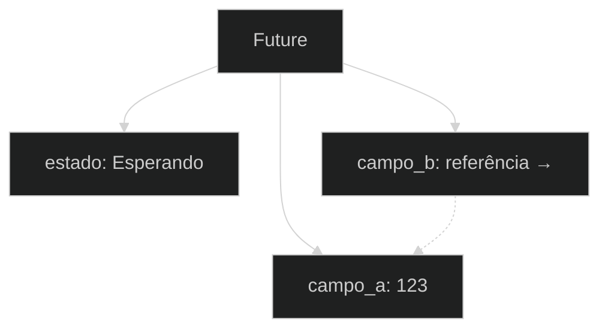
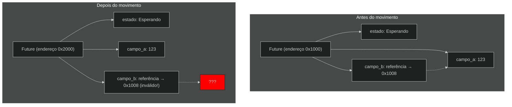
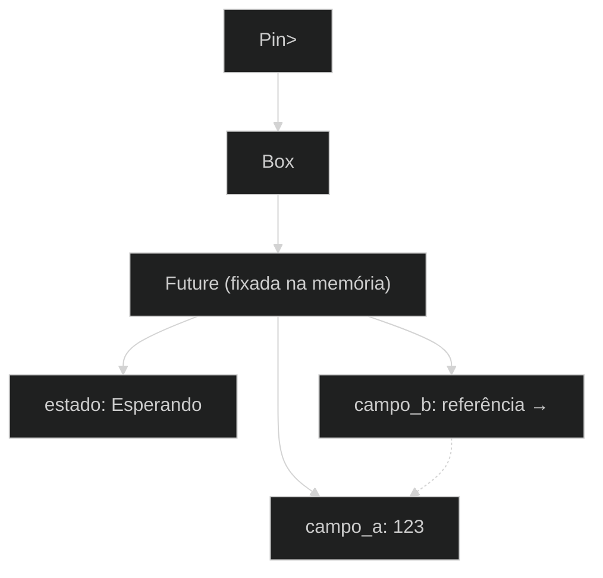
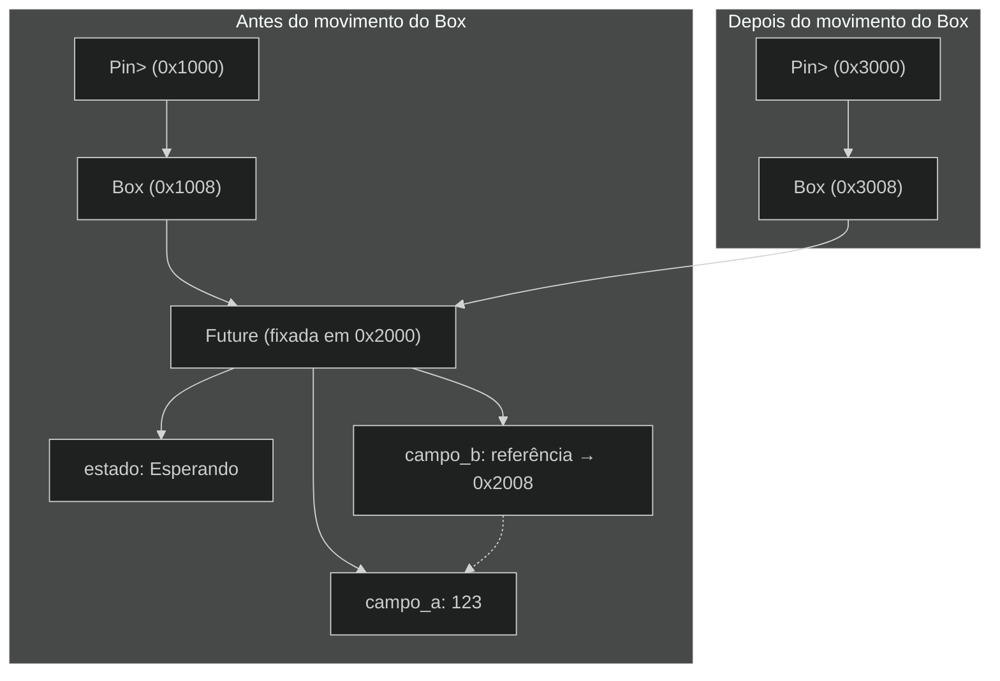
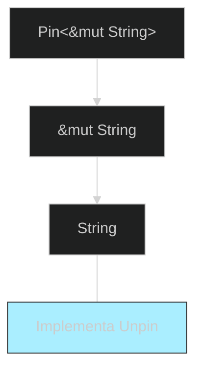

# Um Olhar Mais Detalhado Sobre as Traits para Programação Assíncrona

Ao longo do capítulo, usamos as traits `Future`, `Pin`, `Unpin`, `Stream` e `StreamExt` de várias maneiras. Até agora, evitamos entrar em muitos detalhes sobre como elas funcionam ou como se encaixam, o que geralmente é suficiente para o trabalho diário com Rust. No entanto, ocasionalmente, você encontrará situações onde precisará entender mais alguns desses detalhes. Nesta seção, exploraremos o suficiente para ajudar nesses cenários, deixando um mergulho _realmente_ profundo para outras documentações.

## A Trait `Future`

Vamos começar analisando mais de perto como a trait `Future` funciona. Aqui está como o Rust a define:

```rust
use std::pin::Pin;
use std::task::{Context, Poll};

pub trait Future {
    type Output;

    fn poll(self: Pin<&mut Self>, cx: &mut Context<'_>) -> Poll<Self::Output>;
}
```

Essa definição de trait inclui vários tipos novos e também alguma sintaxe que não vimos antes, então vamos analisar a definição parte por parte.

Primeiro, o tipo associado `Output` da trait `Future` indica o que a future resolverá. Isso é análogo ao tipo associado `Item` da trait `Iterator`. Em segundo lugar, `Future` também tem o método `poll`, que recebe uma referência especial `Pin` para seu parâmetro `self` e uma referência mutável a um tipo `Context`, e retorna um `Poll<Self::Output>`. Falaremos mais sobre `Pin` e `Context` em breve. Por enquanto, vamos nos concentrar no que o método retorna, o tipo `Poll`:

```rust
enum Poll<T> {
    Ready(T),
    Pending,
}
```

Este tipo `Poll` é semelhante a um `Option`. Ele tem uma variante que possui um valor, `Ready(T)`, e uma que não possui, `Pending`. No entanto, `Poll` significa algo bastante diferente de `Option`! A variante `Pending` indica que a future ainda tem trabalho a fazer, então o chamador precisará verificar novamente mais tarde. A variante `Ready` indica que a future terminou seu trabalho e o valor `T` está disponível.

> **Nota:** Com a maioria das futures, o chamador não deve chamar `poll` novamente depois que a future retornou `Ready`. Muitas futures entrarão em pânico se forem consultadas novamente após ficarem prontas. Futures que são seguras para consultar novamente dirão isso explicitamente em sua documentação. Isso é semelhante a como `Iterator::next` se comporta.

Quando você vê código que usa `await`, Rust o compila internamente para código que chama `poll`. Se você olhar novamente para a Listagem 17-4, onde imprimimos o título da página para uma única URL depois que ela foi resolvida, Rust a compila para algo como (embora não exatamente) isto:

```rust
match page_title(url).poll() {
    Ready(page_title) => match page_title {
        Some(title) => println!("O título para {url} foi {title}"),
        None => println!("{url} não tinha título"),
    }
    Pending => {
        // Mas o que vai aqui?
    }
}
```

O que devemos fazer quando a future ainda está `Pending`? Precisamos de alguma forma de tentar novamente, e de novo, e de novo, até que a future esteja finalmente pronta. Em outras palavras, precisamos de um loop:

```rust
let mut page_title_fut = page_title(url);
loop {
    match page_title_fut.poll() {
        Ready(value) => match page_title {
            Some(title) => println!("O título para {url} foi {title}"),
            None => println!("{url} não tinha título"),
        }
        Pending => {
            // continuar
        }
    }
}
```

Se Rust compilasse exatamente para esse código, no entanto, cada `await` seria bloqueante—exatamente o oposto do que desejamos! Em vez disso, Rust garante que o loop possa transferir o controle para algo que possa pausar o trabalho nessa future para trabalhar em outras futures e depois verificar esta novamente mais tarde. Como vimos, esse "algo" é um runtime assíncrono, e esse trabalho de agendamento e coordenação é uma de suas principais funções.

Anteriormente no capítulo, descrevemos a espera por `rx.recv`. A chamada `recv` retorna uma future, e aguardar a future a consulta. Observamos que um runtime pausará a future até que esteja pronta com `Some(message)` ou `None` quando o canal for fechado. Com nossa compreensão mais profunda da trait `Future`, e especificamente `Future::poll`, podemos ver como isso funciona. O runtime sabe que a future não está pronta quando retorna `Poll::Pending`. Por outro lado, o runtime sabe que a future _está_ pronta e a avança quando `poll` retorna `Poll::Ready(Some(message))` ou `Poll::Ready(None)`.

Os detalhes exatos de como um runtime faz isso estão além do escopo deste livro, mas o fundamental é ver a mecânica básica das futures: um runtime _consulta_ cada future pela qual é responsável, colocando a future de volta para dormir quando ainda não está pronta.

## As Traits `Pin` e `Unpin`

Quando introduzimos a ideia de fixação (pinning) na Listagem 17-16, encontramos uma mensagem de erro muito complexa. Aqui está a parte relevante dela novamente:

```
error[E0277]: `{async block@src/main.rs:10:23: 10:33}` cannot be unpinned
  --> src/main.rs:48:33
   |
48 |         trpl::join_all(futures).await;
   |                                 ^^^^^ the trait `Unpin` is not implemented for `{async block@src/main.rs:10:23: 10:33}`, which is required by `Box<{async block@src/main.rs:10:23: 10:33}>: Future`
   |
   = note: consider using the `pin!` macro
           consider using `Box::pin` if you need to access the pinned value outside of the current scope
   = note: required for `Box<{async block@src/main.rs:10:23: 10:33}>` to implement `Future`
note: required by a bound in `futures_util::future::join_all::JoinAll`
  --> file:///home/.cargo/registry/src/index.crates.io-6f17d22bba15001f/futures-util-0.3.30/src/future/join_all.rs:29:8
   |
27 | pub struct JoinAll<F>
   |            ------- required by a bound in this struct
28 | where
29 |     F: Future,
   |        ^^^^^^ required by this bound in `JoinAll`
```

Esta mensagem de erro nos diz não apenas que precisamos fixar os valores, mas também por que a fixação é necessária. A função `trpl::join_all` retorna uma estrutura chamada `JoinAll`. Essa estrutura é genérica sobre um tipo `F`, que é restrito a implementar a trait `Future`. Aguardar diretamente uma future com `await` fixa a future implicitamente. É por isso que não precisamos usar `pin!` em todos os lugares onde queremos aguardar futures.

No entanto, não estamos aguardando diretamente uma future aqui. Em vez disso, construímos uma nova future, `JoinAll`, passando uma coleção de futures para a função `join_all`. A assinatura de `join_all` requer que os tipos dos itens na coleção implementem a trait `Future`, e `Box<T>` implementa `Future` apenas se o `T` que ele envolve for uma future que implementa a trait `Unpin`.

Isso é muito para absorver! Para realmente entender, vamos mergulhar um pouco mais fundo em como a trait `Future` realmente funciona, em particular em torno da _fixação_ (pinning).

Olhe novamente para a definição da trait `Future`:

```rust
use std::pin::Pin;
use std::task::{Context, Poll};

pub trait Future {
    type Output;

    // Método obrigatório
    fn poll(self: Pin<&mut Self>, cx: &mut Context<'_>) -> Poll<Self::Output>;
}
```

O parâmetro `cx` e seu tipo `Context` são a chave para como um runtime realmente sabe quando verificar uma determinada future enquanto ainda é preguiçoso. Novamente, os detalhes de como isso funciona estão além do escopo deste capítulo, e geralmente você só precisa pensar nisso ao escrever uma implementação personalizada de `Future`. Vamos nos concentrar, em vez disso, no tipo para `self`, pois esta é a primeira vez que vemos um método onde `self` tem uma anotação de tipo. Uma anotação de tipo para `self` funciona como anotações de tipo para outros parâmetros de função, mas com duas diferenças-chave:

- Ela diz ao Rust qual tipo `self` deve ser para que o método seja chamado.
- Não pode ser qualquer tipo. Está restrito ao tipo no qual o método é implementado, uma referência ou ponteiro inteligente para esse tipo, ou um `Pin` envolvendo uma referência para esse tipo.

Veremos mais sobre esta sintaxe no Capítulo 18. Por enquanto, é suficiente saber que se quisermos consultar uma future para verificar se está `Pending` ou `Ready(Output)`, precisamos de uma referência mutável envolvida em `Pin` para o tipo.

`Pin` é um wrapper para tipos semelhantes a ponteiros, como `&`, `&mut`, `Box` e `Rc`. (Tecnicamente, `Pin` funciona com tipos que implementam as traits `Deref` ou `DerefMut`, mas isso é efetivamente equivalente a trabalhar apenas com ponteiros.) `Pin` não é um ponteiro em si e não possui nenhum comportamento próprio como `Rc` e `Arc` fazem com contagem de referência; é puramente uma ferramenta que o compilador pode usar para impor restrições ao uso de ponteiros.

Lembrando que `await` é implementado em termos de chamadas a `poll` começa a explicar a mensagem de erro que vimos anteriormente, mas isso foi em termos de `Unpin`, não `Pin`. Então, como exatamente `Pin` se relaciona com `Unpin`, e por que `Future` precisa que `self` esteja em um tipo `Pin` para chamar `poll`?

Lembre-se de que, anteriormente neste capítulo, uma série de pontos de await em uma future são compilados em uma máquina de estados, e o compilador garante que essa máquina de estados siga todas as regras normais de segurança do Rust, incluindo empréstimo e propriedade. Para fazer isso funcionar, Rust analisa quais dados são necessários entre um ponto de await e o próximo ponto de await ou o final do bloco async. Em seguida, cria uma variante correspondente na máquina de estados compilada. Cada variante obtém o acesso necessário aos dados que serão usados nessa seção do código-fonte, seja assumindo a propriedade desses dados ou obtendo uma referência mutável ou imutável a eles.

Até aqui, tudo bem: se cometermos algum erro sobre propriedade ou referências em um determinado bloco async, o verificador de empréstimo nos informará. Quando queremos mover a future que corresponde a esse bloco—como movê-la para um `Vec` para passar para `join_all`—as coisas ficam mais complicadas.

Quando movemos uma future—seja empurrando-a para uma estrutura de dados para usar como um iterador com `join_all` ou retornando-a de uma função—isso realmente significa mover a máquina de estados que Rust cria para nós. E, diferentemente da maioria dos outros tipos em Rust, as futures que Rust cria para blocos async podem acabar com referências a si mesmas nos campos de qualquer variante, como mostrado na ilustração simplificada na Figura 17-4.


*Figura 17-4: Um tipo de dados auto-referencial.*

Por padrão, qualquer objeto que tenha uma referência a si mesmo é inseguro para mover, porque as referências sempre apontam para o endereço de memória real do que elas se referem (veja a Figura 17-5). Se você mover a estrutura de dados em si, essas referências internas continuarão apontando para o local antigo. No entanto, esse local de memória agora é inválido. Por um lado, seu valor não será atualizado quando você fizer alterações na estrutura de dados. Por outro lado—mais importante—o computador agora está livre para reutilizar essa memória para outros fins! Você poderia acabar lendo dados completamente não relacionados mais tarde.


*Figura 17-5: O resultado inseguro de mover um tipo de dados auto-referencial*

Teoricamente, o compilador Rust poderia tentar atualizar cada referência a um objeto sempre que ele é movido, mas isso poderia adicionar muita sobrecarga de desempenho, especialmente se toda uma rede de referências precisasse ser atualizada. Se pudéssemos, em vez disso, garantir que a estrutura de dados em questão _não se mova na memória_, não teríamos que atualizar nenhuma referência. É exatamente isso que o verificador de empréstimo do Rust exige: em código seguro, ele impede que você mova qualquer item com uma referência ativa para ele.

`Pin` se baseia nisso para nos dar a garantia exata que precisamos. Quando _fixamos_ um valor envolvendo um ponteiro para esse valor em `Pin`, ele não pode mais se mover. Assim, se você tem `Pin<Box<SomeType>>`, você realmente fixa o valor `SomeType`, _não_ o ponteiro `Box`. A Figura 17-6 ilustra esse processo.


*Figura 17-6: Fixando um `Box` que aponta para um tipo de future auto-referencial.*

Na verdade, o ponteiro `Box` ainda pode se mover livremente. Lembre-se: nos preocupamos em garantir que os dados referenciados permaneçam no lugar. Se um ponteiro se move, _mas os dados para os quais ele aponta estão no mesmo lugar_, como na Figura 17-7, não há problema potencial. (Como exercício independente, veja a documentação dos tipos e também o módulo `std::pin` e tente descobrir como você faria isso com um `Pin` envolvendo um `Box`.) A chave é que o tipo auto-referencial em si não pode se mover, porque ainda está fixado.


*Figura 17-7: Movendo um `Box` que aponta para um tipo de future auto-referencial.*

No entanto, a maioria dos tipos é perfeitamente segura para mover, mesmo que estejam por trás de um ponteiro `Pin`. Só precisamos pensar em fixação quando os itens têm referências internas. Valores primitivos como números e booleanos são seguros, pois obviamente não têm referências internas, então são obviamente seguros. Nem a maioria dos tipos com os quais você normalmente trabalha em Rust. Você pode mover um `Vec`, por exemplo, sem se preocupar. Dado apenas o que vimos até agora, se você tiver um `Pin<Vec<String>>`, teria que fazer tudo através das APIs seguras, mas restritivas, fornecidas por `Pin`, mesmo que um `Vec<String>` seja sempre seguro para mover se não houver outras referências a ele. Precisamos de uma maneira de dizer ao compilador que é bom mover itens em casos como este—e é aí que `Unpin` entra em jogo.

`Unpin` é uma trait marcadora, semelhante às traits `Send` e `Sync` que vimos no Capítulo 16, e, portanto, não tem funcionalidade própria. Traits marcadoras existem apenas para informar ao compilador que é seguro usar o tipo que implementa uma determinada trait em um contexto particular. `Unpin` informa ao compilador que um dado tipo _não_ precisa manter garantias sobre se o valor em questão pode ser movido com segurança.

Assim como com `Send` e `Sync`, o compilador implementa `Unpin` automaticamente para todos os tipos onde pode provar que é seguro. Um caso especial, novamente semelhante a `Send` e `Sync`, é onde `Unpin` _não_ é implementado para um tipo. A notação para isso é `impl !Unpin for _SomeType_`, onde `_SomeType_` é o nome de um tipo que _realmente_ precisa manter essas garantias para ser seguro sempre que um ponteiro para esse tipo for usado em um `Pin`.

Em outras palavras, há duas coisas a ter em mente sobre a relação entre `Pin` e `Unpin`. Primeiro, `Unpin` é o caso "normal", e `!Unpin` é o caso especial. Segundo, se um tipo implementa `Unpin` ou `!Unpin` _só_ importa quando você está usando um ponteiro fixado para esse tipo, como `Pin<&mut_SomeType_>`.

Para tornar isso concreto, pense em uma `String`: ela tem um comprimento e os caracteres Unicode que a compõem. Podemos envolver uma `String` em `Pin`, como visto na Figura 17-8. No entanto, `String` implementa automaticamente `Unpin`, assim como a maioria dos outros tipos em Rust.


*Figura 17-8: Fixando uma `String`; a linha pontilhada indica que a `String` implementa a trait `Unpin` e, portanto, não está realmente fixada.*

Como resultado, podemos fazer coisas que seriam ilegais se `String` implementasse `!Unpin` em vez disso, como substituir uma string por outra exatamente no mesmo local da memória, como na Figura 17-9. Isso não viola o contrato `Pin`, porque `String` não possui referências internas que a tornem insegura para mover! É precisamente por isso que ela implementa `Unpin` em vez de `!Unpin`.


*Figura 17-9: Substituindo a `String` por uma `String` completamente diferente na memória.*

Agora sabemos o suficiente para entender os erros relatados para aquela chamada `join_all` de volta na Listagem 17-17. Originalmente, tentamos mover as futures produzidas por blocos async para um `Vec<Box<dyn Future<Output = ()>>>`, mas como vimos, essas futures podem ter referências internas, por isso não implementam `Unpin`. Elas precisam ser fixadas, e então podemos passar o tipo `Pin` para o `Vec`, confiantes de que os dados subjacentes nas futures _não_ serão movidos.

`Pin` e `Unpin` são principalmente importantes para a construção de bibliotecas de nível inferior, ou quando você está construindo um runtime em si, em vez de para código Rust do dia a dia. Quando você vir essas traits em mensagens de erro, agora terá uma ideia melhor de como corrigir seu código!

> **Nota:** Esta combinação de `Pin` e `Unpin` torna possível implementar com segurança toda uma classe de tipos complexos em Rust que, de outra forma, seriam desafiadores porque são auto-referenciais. Tipos que exigem `Pin` aparecem mais comumente em Rust assíncrono hoje, mas de vez em quando, você pode vê-los em outros contextos também.

Os detalhes específicos de como `Pin` e `Unpin` funcionam, e as regras que são obrigados a cumprir, são amplamente cobertos na documentação da API para `std::pin`, então se você estiver interessado em aprender mais, esse é um ótimo lugar para começar.

Se você quiser entender como as coisas funcionam sob o capô com ainda mais detalhes, consulte os Capítulos 2 e 4 de _Programação Assíncrona em Rust_.

## A Trait `Stream`

Agora que você tem uma compreensão mais profunda das traits `Future`, `Pin` e `Unpin`, podemos voltar nossa atenção para a trait `Stream`. Como você aprendeu anteriormente no capítulo, streams são semelhantes a iteradores assíncronos. Diferentemente de `Iterator` e `Future`, no entanto, `Stream` não tem definição na biblioteca padrão no momento da escrita, mas _há_ uma definição muito comum do crate `futures` usado em todo o ecossistema.

Vamos revisar as definições das traits `Iterator` e `Future` antes de examinar como uma trait `Stream` pode mesclá-las. De `Iterator`, temos a ideia de uma sequência: seu método `next` fornece um `Option<Self::Item>`. De `Future`, temos a ideia de prontidão ao longo do tempo: seu método `poll` fornece um `Poll<Self::Output>`. Para representar uma sequência de itens que se tornam prontos ao longo do tempo, definimos uma trait `Stream` que reúne esses recursos:

```rust
use std::pin::Pin;
use std::task::{Context, Poll};

trait Stream {
    type Item;

    fn poll_next(
        self: Pin<&mut Self>,
        cx: &mut Context<'_>
    ) -> Poll<Option<Self::Item>>;
}
```

A trait `Stream` define um tipo associado chamado `Item` para o tipo dos itens produzidos pelo stream. Isso é semelhante a `Iterator`, onde pode haver de zero a muitos itens, e diferente de `Future`, onde há sempre um único `Output`, mesmo que seja o tipo unitário `()`.

`Stream` também define um método para obter esses itens. Chamamos de `poll_next`, para deixar claro que ele sonda da mesma forma que `Future::poll` e produz uma sequência de itens da mesma forma que `Iterator::next`. Seu tipo de retorno combina `Poll` com `Option`. O tipo externo é `Poll`, porque precisa ser verificado quanto à prontidão, exatamente como uma future. O tipo interno é `Option`, porque precisa sinalizar se há mais mensagens, exatamente como um iterador.

Algo muito semelhante a esta definição provavelmente acabará como parte da biblioteca padrão do Rust. Enquanto isso, é parte do kit de ferramentas da maioria dos runtimes, então você pode confiar nele, e tudo o que cobriremos a seguir deve se aplicar geralmente!

No exemplo que vimos na seção sobre streaming, no entanto, não usamos `poll_next` _ou_ `Stream`, mas sim `next` e `StreamExt`. _Poderíamos_ trabalhar diretamente em termos da API `poll_next` escrevendo nossas próprias máquinas de estado `Stream` manualmente, é claro, assim como _poderíamos_ trabalhar com futures diretamente via seu método `poll`. Usar `await` é muito mais agradável, no entanto, e a trait `StreamExt` fornece o método `next` para que possamos fazer exatamente isso:

```rust
use std::pin::Pin;
use std::task::{Context, Poll};

trait Stream {
    type Item;
    fn poll_next(
        self: Pin<&mut Self>,
        cx: &mut Context<'_>,
    ) -> Poll<Option<Self::Item>>;
}

trait StreamExt: Stream {
    async fn next(&mut self) -> Option<Self::Item>
    where
        Self: Unpin;

    // outros métodos...
}
```

> **Nota:** A definição real que usamos anteriormente no capítulo parece um pouco diferente desta, porque suporta versões do Rust que ainda não suportavam o uso de funções assíncronas em traits. Como resultado, se parece com isto:
> 
> ```rust
> fn next(&mut self) -> Next<'_, Self> where Self: Unpin;
> ```
> 
> Esse tipo `Next` é uma `struct` que implementa `Future` e nos permite nomear o tempo de vida da referência a `self` com `Next<'_, Self>`, para que `await` possa funcionar com este método.

A trait `StreamExt` também é o lar de todos os métodos interessantes disponíveis para uso com streams. `StreamExt` é automaticamente implementado para cada tipo que implementa `Stream`, mas essas traits são definidas separadamente para permitir que a comunidade itere em APIs de conveniência sem afetar a trait fundamental.

Na versão de `StreamExt` usada no crate `trpl`, a trait não apenas define o método `next`, mas também fornece uma implementação padrão de `next` que lida corretamente com os detalhes de chamar `Stream::poll_next`. Isso significa que mesmo quando você precisa escrever seu próprio tipo de dados de streaming, você _só_ precisa implementar `Stream`, e então qualquer pessoa que use seu tipo de dados pode usar `StreamExt` e seus métodos com ele automaticamente.

Isso é tudo o que vamos cobrir sobre os detalhes de nível inferior dessas traits. Para concluir, vamos considerar como futures (incluindo streams), tarefas e threads se encaixam!